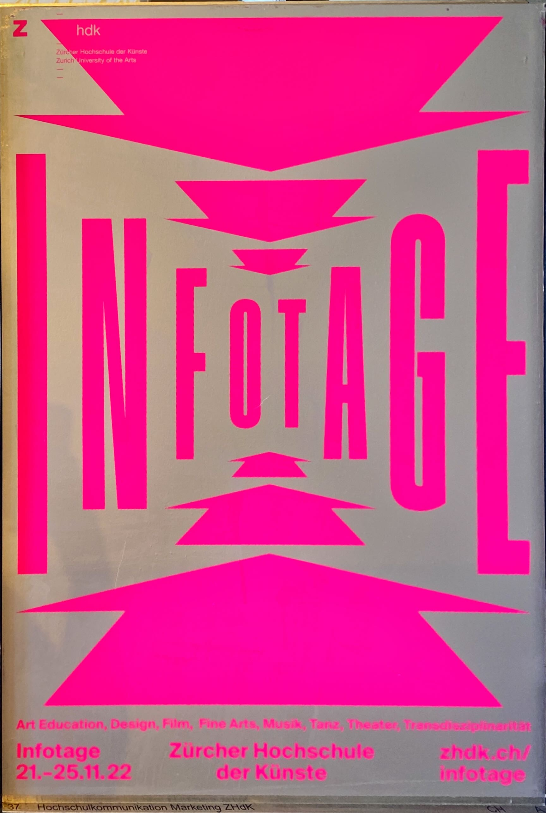
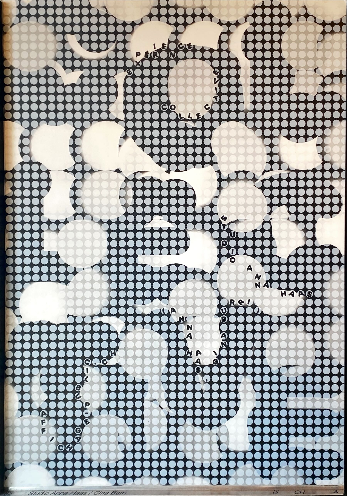
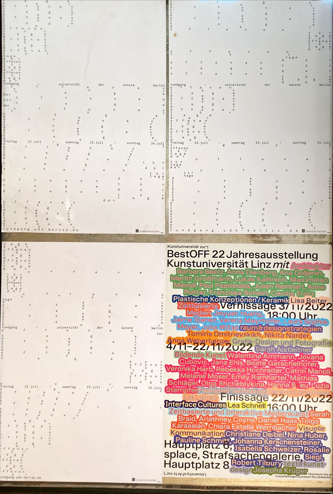
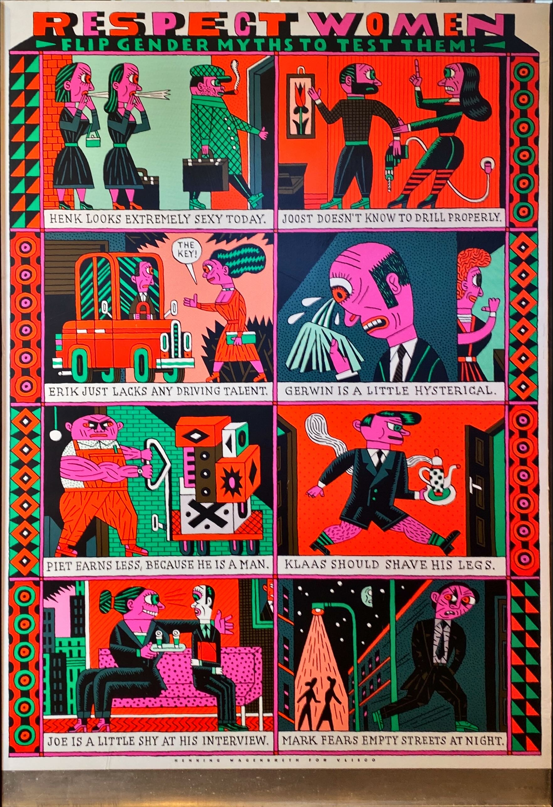
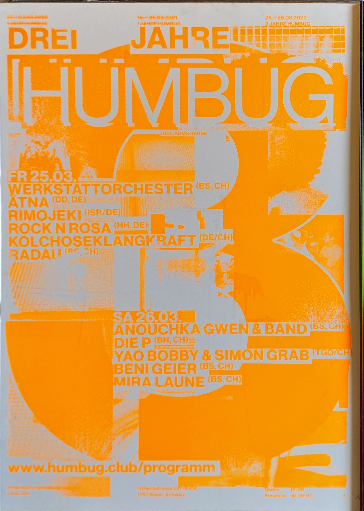

# Weltformat

## Aufgabe

> Zu zweit je ein Plakat evaluieren, welches aus eurer Sicht als Plakat funktioniert (Funktion, Gestaltung, Hierarchie, Leseebenen, Wirkung, etc.) und ein Plakat, welches für euch nicht funktioniert.

### Funktioniert

- Informativ
- kreeiert einen Raum, der die Infotage darstellt
- mit Pfeilen wird sehr stark der Eindruck vermittelt, dass man dahin gehen soll.

### Funktioniert nicht

- Ansprechend, aber nicht wirklich lesbar
- Anstrengend zum anschauen

- Grelle Farben hindern daran, die Informationen zu lesen
- Fokus wird zwar stark auf den schwarzen Text gelenkt, das funktioniert
- nicht klar, wieso die Namen und Kategorien in den Farben dargestellt werden

### Gefallen mir

